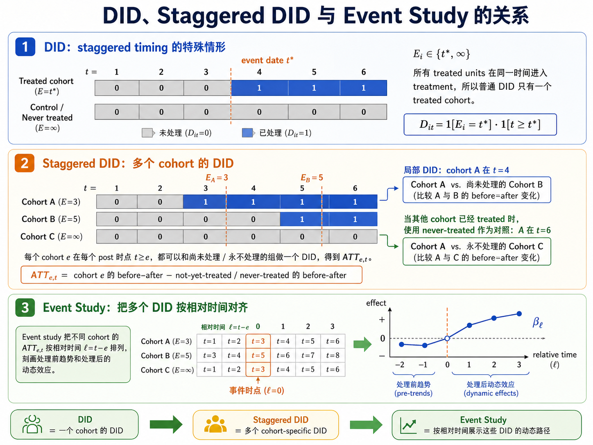

# 07 DiD, RD, and Kernel Smoothing

Source: consolidated from 12_DiD_Fixed_Effects_Event_Study.md and 13_RD_Nonparametric_Kernel.md.
Links: [06_Potential_Outcomes_LATE_Roy_MTE](06_Potential_Outcomes_LATE_Roy_MTE) | [cards/DID_Common_Trends](cards/DID_Common_Trends) | [cards/TWFE_Event_Study](cards/TWFE_Event_Study) | [cards/Kernel_Bandwidth_Bias_Variance](cards/Kernel_Bandwidth_Bias_Variance)

**Panel Treatment Effects and Fixed Effects**

## Two-by-Two DiD Estimand

Two groups $D_i\in\{0,1\}$, two periods $Post_t\in\{0,1\}$。Treatment group receives treatment only in post period。

:::{admonition} Definition (Difference-in-differences estimand)
$$
\tau_{DiD}=[E(Y\mid D=1,Post=1)-E(Y\mid D=1,Post=0)] -[E(Y\mid D=0,Post=1)-E(Y\mid D=0,Post=0)].
$$

**Definition (Common trends assumption):**
In the absence of treatment, treated and control groups would have experienced the same average change:
$$
E[Y_0(1)-Y_0(0)\mid D=1]=E[Y_0(1)-Y_0(0)\mid D=0].
$$
:::

:::{admonition} Lemma (DiD identifies ATT under common trends)
$$
\tau_{DiD}=E[Y_1(1)-Y_0(1)\mid D=1].
$$
:::

#### Proof of Lemma (DiD identifies ATT under common trends)

Observed:
$$
Y_{it}=D_iPost_tY_{1t}+(1-D_iPost_t)Y_{0t}.
$$

$$
\begin{aligned}
\tau_{DiD} &=\{E[Y_1(1)\mid D=1]-E[Y_0(0)\mid D=1]\}\\
&\quad -\{E[Y_0(1)\mid D=0]-E[Y_0(0)\mid D=0]\}\\
&=E[Y_1(1)-Y_0(1)\mid D=1]\\
&\quad +\{E[Y_0(1)-Y_0(0)\mid D=1]-E[Y_0(1)-Y_0(0)\mid D=0]\}\\
&=ATT+0.
\end{aligned}
$$

DiD subtracts off the untreated counterfactual trend using control group trend。

$$
Y_{it}=\alpha+\gamma D_i+\lambda Post_t+\tau(D_iPost_t)+u_{it}.
$$

$$
Y_{it}=\alpha_i+\lambda_t+\tau D_{it}+u_{it}.
$$

$$
Y_{it}=\alpha_i+\lambda_t+\sum_{\ell\ne -1}\tau_\ell 1[t-G_i=\ell]+u_{it}.
$$

:::{admonition} Lemma (Group fixed effects residualization)
$$
\tilde\beta=\hat\beta.
$$
:::

$$
\dot Y_i=Y_i-\bar Y_{F_i}, \qquad \dot X_i=X_i-\bar X_{F_i}.
$$

$$
\begin{aligned}
\hat\beta &=(X'M_{D_F}X)^{-1}X'M_{D_F}Y\\
&=\left(\sum_i\dot X_i\dot X_i'\right)^{-1}\left(\sum_i\dot X_i\dot Y_i\right)\\
&=\tilde\beta.
\end{aligned}
$$

$$
\bar Y_d^{post}=\frac1{T-t^*+1}\sum_{t=t^*}^T\bar Y_{dt},
\qquad
\bar Y_d^{pre}=\frac1{t^*-1}\sum_{t=1}^{t^*-1}\bar Y_{dt}.
$$

:::{admonition} Lemma (Unit FE only identifies treated before-after change)
$$
\hat\beta_{unit}=\bar Y_1^{post}-\bar Y_1^{pre}.
$$
:::

$$
\dot D_{it}=D_i\left(1[t\ge t^*]-\frac{T-t^*+1}{T}\right).
$$

$$
\hat\beta_{unit}=\bar Y_1^{post}-\bar Y_1^{pre}.
$$

:::{admonition} Lemma (Time FE only identifies post treated-control difference)
$$
\hat\beta_{time}=\bar Y_1^{post}-\bar Y_0^{post}.
$$
:::

$$
\dot D_{it}=Post_t-\bar{Post}.
$$

$$
\hat\beta_{time}=\bar Y_1^{post}-\bar Y_0^{post}.
$$

:::{admonition} Lemma (Unit and time FE identify the DiD contrast)
$$
\hat\beta_{ddmn}=\bar Y_1^{post}-\bar Y_1^{pre}-\bar Y_0^{post}+\bar Y_0^{pre}.
$$
:::

$$
(1,post)-(1,pre)-(0,post)+(0,pre).
$$

$$
\hat\beta_{ddmn}
=\bar Y_1^{post}-\bar Y_1^{pre}-\bar Y_0^{post}+\bar Y_0^{pre}.
$$

## Pre-Trends and Event Studies

$$
Y_{it}=\alpha_i+\lambda_t+\sum_{k\ne -1}\tau_k1[t-G_i=k]+u_{it}.
$$

Pre-trend null:

$$
\tau_k=0,\qquad k<0.
$$

Relative-time coefficient:

$$
\tau_k=\sum_{g\in\mathcal G_k}\omega_{g,k}ATT(g,g+k).
$$

### Staggered Timing and Aggregation

Cohort-time ATT:

$$
ATT(g,t)=E[Y_t(1)-Y_t(0)\mid G_i=g],\qquad t\ge g.
$$

Relative time $r=t-g$ aggregation:

$$
ATT^{ES}(r)=\sum_{g\in\mathcal G_r}\omega_{g,r}ATT(g,g+r),
\qquad
\omega_{g,r}
\equiv
\frac{P(G_i=g,\ g+r\le T)}{\sum_{g'\in\mathcal G_r}P(G_i=g',\ g'+r\le T)}.
$$

Overall aggregation:

$$
ATT^{overall}
=\sum_{r\ge 0}\pi_r ATT^{ES}(r)
=\sum_{g}\sum_{t\ge g}\omega_{g,t}ATT(g,t).
$$

TWFE with staggered adoption mixes cohort-time effects:

$$
\hat\beta_{TWFE}
=\sum_{g}\sum_{t\ge g}\omega^{TWFE}_{g,t}ATT(g,t),
\qquad
\sum_{g,t}\omega^{TWFE}_{g,t}=1,
\qquad
\omega^{TWFE}_{g,t}\not\ge 0\ \text{in general}.
$$

## Triple-Differences Estimand

:::{admonition} Definition (Triple differences)
If there is another comparison dimension $S\in\{0,1\}$, DDD is
$$
DDD=DiD(S=1)-DiD(S=0).
$$
It removes shocks common to treated/control over time within both $S$ groups and differential time shocks shared across treatment states。

:::

In regression form, DDD is the coefficient on the triple interaction $D_i\times Post_t\times S_i$。

## DiD Inference Issues

With one treated cluster, consistency may fail even if $N\to\infty$:

$$
\hat\tau-\tau
\not\to 0
\qquad\text{if the treated-cluster shock does not average out.}
$$

Cluster-robust inference needs many independent clusters, or randomization / design-based alternatives.

### RD Identification and Local IV

:::{admonition} Definition (Sharp regression discontinuity)
$$
D=1[R\ge c].
$$

$$
\tau_{SRD}
=\lim_{r\downarrow c}E[Y\mid R=r]-\lim_{r\uparrow c}E[Y\mid R=r].
$$
:::

Identification uses continuity at the cutoff:

$$
\lim_{r\downarrow c}E[Y(0)\mid R=r]=\lim_{r\uparrow c}E[Y(0)\mid R=r],
\qquad
\lim_{r\downarrow c}E[Y(1)\mid R=r]=\lim_{r\uparrow c}E[Y(1)\mid R=r].
$$

If treatment probability jumps but not from $0$ to $1$,

$$
\tau_{FRD}
=\frac{\lim_{r\downarrow c}E[Y\mid R=r]-\lim_{r\uparrow c}E[Y\mid R=r]}{\lim_{r\downarrow c}E[D\mid R=r]-\lim_{r\uparrow c}E[D\mid R=r]}.
$$

:::{admonition} Lemma (Fuzzy RD is a Wald ratio)
$$
\tau_{FRD}=\frac{\Delta_Y(c)}{\Delta_D(c)}.
$$
:::

$$
\begin{aligned}
\Delta_Y(c)
&=\lim_{r\downarrow c}E[Y\mid R=r]-\lim_{r\uparrow c}E[Y\mid R=r],\\
\Delta_D(c)
&=\lim_{r\downarrow c}E[D\mid R=r]-\lim_{r\uparrow c}E[D\mid R=r],\\
\tau_{FRD}
&=\frac{\Delta_Y(c)}{\Delta_D(c)}.
\end{aligned}
$$

$$
\begin{aligned}
\Delta_Y(c)
&=E[Y_1-Y_0\mid R=c^+]-E[Y_1-Y_0\mid R=c^-],\\
\Delta_D(c)
&=P(D=1\mid R=c^+)-P(D=1\mid R=c^-).
\end{aligned}
$$

### Local Polynomial Estimation and 2SLS

:::{admonition} Lemma (Local linear fuzzy RD as 2SLS)
Within $[c-h,c+h]$,

$$
\hat\beta
=\frac{\hat\alpha_Y^1-\hat\alpha_Y^0}{\hat\alpha_D^1-\hat\alpha_D^0}.
$$
:::

$$
\begin{aligned}
(\hat\alpha_s,\hat\beta_s)
&=\arg\min_{a,b}\sum_{i:R_i\in\mathcal N_s(c,h)}K\!\left(\frac{R_i-c}{h}\right)(Y_i-a-b(R_i-c))^2,\\
\hat\alpha_Y^1-\hat\alpha_Y^0
&=\widehat{RF},\\
\hat\alpha_D^1-\hat\alpha_D^0
&=\widehat{FS},\\
\hat\beta
&=\frac{\widehat{RF}}{\widehat{FS}}
=\frac{\hat\alpha_Y^1-\hat\alpha_Y^0}{\hat\alpha_D^1-\hat\alpha_D^0}.
\end{aligned}
$$

$$
Y_i=\alpha+\beta D_i+\gamma(R_i-c)+\delta Z_i(R_i-c)+u_i,
\qquad
Z_i=1[R_i\ge c].
$$

### Kernels and Bandwidth Choice

:::{admonition} Definition (Kernel estimator)
For $g(x)=E[Y\mid X=x]$,

$$
\hat g(x)=\frac{\sum_iY_iK_h(X_i-x)}{\sum_iK_h(X_i-x)},
\qquad
K_h(u)=K(u/h).
$$
:::

:::{admonition} Lemma (Bias-variance tradeoff for kernel regression)
In the univariate case,

$$
MSE(\hat g(x))=O((nh)^{-1})+O(h^4).
$$
:::

$$
\begin{aligned}
\operatorname{Bias}(\hat g(x))&=O(h^2),\\
\operatorname{Var}(\hat g(x))&=O((nh)^{-1}),\\
MSE(\hat g(x))&=\operatorname{Var}+\operatorname{Bias}^2\\
&=O((nh)^{-1})+O(h^4).
\end{aligned}
$$

$$
h^4\asymp (nh)^{-1}
\quad\Rightarrow\quad
h^5\asymp n^{-1}
\quad\Rightarrow\quad
h\asymp n^{-1/5}.
$$

If $q$ covariates enter with the same bandwidth $h$,

$$
\text{variance}=O((nh^q)^{-1}),
\qquad
\text{squared bias}=O(h^4),
\qquad
h\asymp n^{-1/(q+4)},
\qquad
MSE=O(n^{-4/(q+4)}).
$$

Leave-one-out CV:

$$
\hat y_{i,h}
=\frac{\sum_{j\ne i}Y_jK_h(X_j-X_i)}{\sum_{j\ne i}K_h(X_j-X_i)},
\qquad
CV(h)=\sum_i(Y_i-\hat y_{i,h})^2,
\qquad
\hat h=\arg\min_hCV(h).
$$
